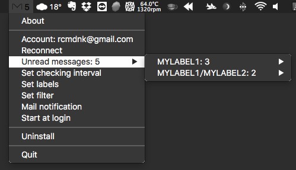

# MenuBarGmail

Gmail notification in Menu Bar for Mac.

Unread messages of Gmail are checked and the number of unread messages
is shown in the menu bar.

Default setting checks only Inbox.
Multi-label can be set to be checked.

Short information of unread messages are shown in the menu.

New message notification is also available, too.

# Installation

With [Homebrew Cask](http://caskroom.io/), do:

    $ brew install rcmdnk/rcmdnkcask/menubargmail

Or download the app and install it in **/Applications** or **~/Applications**.

# Uninstall

Launch MenuBarGmail, and click **Uninstall** menu from menu bar icon.

This function will remove

* $HOME/.menubargmail_oauth
* $HOME/.menubargmail_settings
* $HOME/Library/LaunchAgents/menubargmail.plist
* $HOME/Library/Application Support/MenuBarGmail/
* MenuBarGmail.app

# Usage

When you start MenuBarGmail,
an authentication page will be open in a browser.
**Accept** it, then a following icon will appear in the menubar.

Following menus are available:

* About: Show information of MenuBarGmail.
* Account: Current account.
    * Gmail page will be open by clicking this.
* Check now: Check mails now.
* Reconnect: Renew account authentication.
    * If you want to change an account, login to other account in default browser, then click Reconnect.
* Unread messages: Number and details of unread messages.
* Set checking interval: Set interval to check mails (Default: 60 (sec)).
* Set labels: Set labels (comma-separated) to be checked (Default: "").
* Set filter: Set filter for mail search (Defalt: "").
* Mail notification: Toggle if a notification is shown or not when the new message comes.
* Start at login: Toggle if starting at login or not.
* Uninstall: Uninstall MenuBarGmail.
* Quit: Quit MenuBarGmail.

If both labels and filter are not set (empty),
INBOX is checked (this is default).

For filter details, refer: [Advanced search - Gmail Help](https://support.google.com/mail/answer/7190).

Message details (Date, From, Subject, Short summary of message)
can be seen as a submenu of **Unread message**.

If more than one mails are unread in a same thread, only the last is shown.

If two different labels are set,
each label is shown as a submenu then details are shown as a submenu of it.

A pop up window with full details will be shown
by clicking these submenus.
On the window, **Mark as read** and **Open in browser** buttons are availabl.

# How to build

Tested at macOS 12.4 Monterey, Python 3.9.13

* Install packages

    $ pip install -r requirements.txt

* Build

        $ python setup.py py2app

then, **MenuBarGmail.app** will appear in **./dist** directory.
